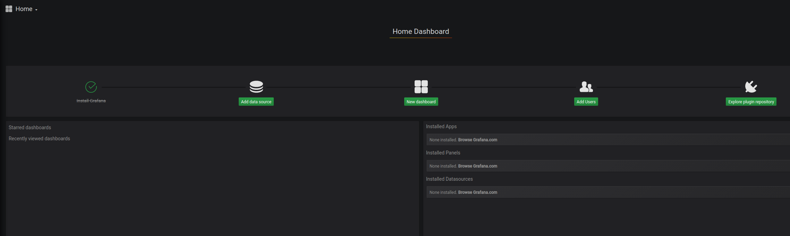
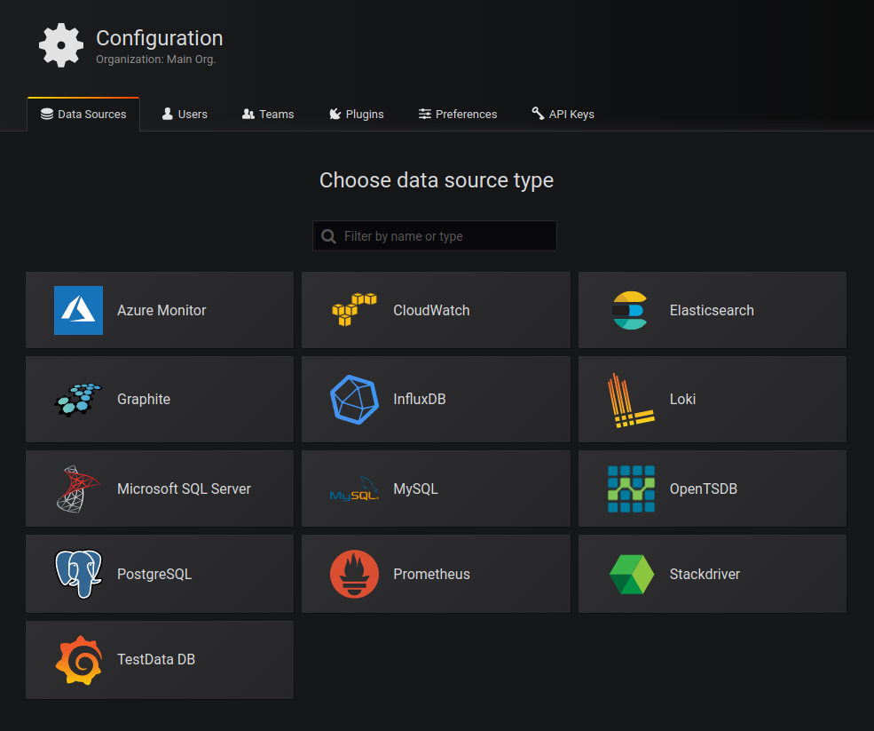
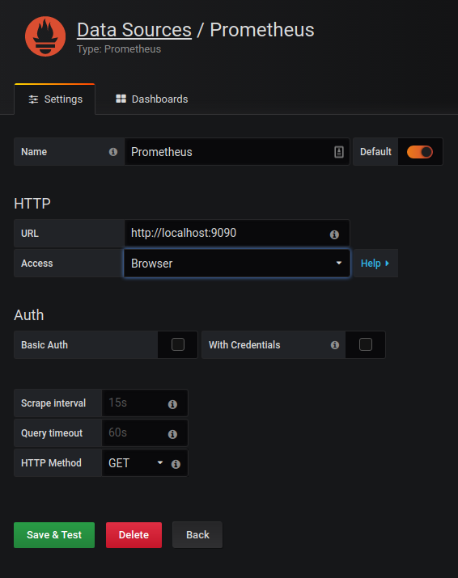
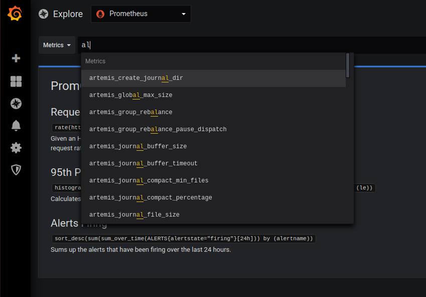

# Local artemis with Prometheus and Grafana And dbs
This setup will start a 3 node Artemis cluster, a Prometheus instance a Grafana instance and docker db instances. You should be able to choose which services should be running and which should be offline. Just follow instructions regarding your local docker-compose.override.yaml. OBS do not commit the docker-compose.override.yaml  
## Usage
Commands for managing the cluster
``` bash 
# With output in console
docker-compose up
# Stop with ctrl+c  

# Run in background
docker-compose up -d  
# Stop with  
docker-compose stop  

# Terminate cluster
docker-compose down
```
## Artemis docker-cluster
When the instances are up and running you will have this setup  
  
It will expose the three nodes on this ports  
node1: 61616 and 8161  
node2: 61617 and 8162  
node3: 61618 and 8163  

### Connection
Connect through this URLs
#### node1
http://localhost:8161/console  
#### node2
http://localhost:8162/console
#### node3
http://localhost:8163/console

## Prometheus
You can connect to the prometheus server on http://localhost:9090

## Grafana
You can connect to Grafana on http://localhost:3000

### Configuration
First you need to set up a data source. Click on __Add data source__ to start  
  
  
Then choose __Prometheus__  
  
  
Fill in these settings and press __Save & Test__  
  
  
Then you are ready to explore the metrics  


### Mongo

There is a mongo db service and a mongo-express in the docker-compose that should be used as backend for the hobby-mat-app in github link (TODO add link)

When starting the docker-compose for the first time maybe it is a good idea to import the 3 collections under mongo_backup (TODO maybe do it automatically)

It is easily achieved by doing 3 imports using the following link

http://localhost:8081/db/hobbymat/